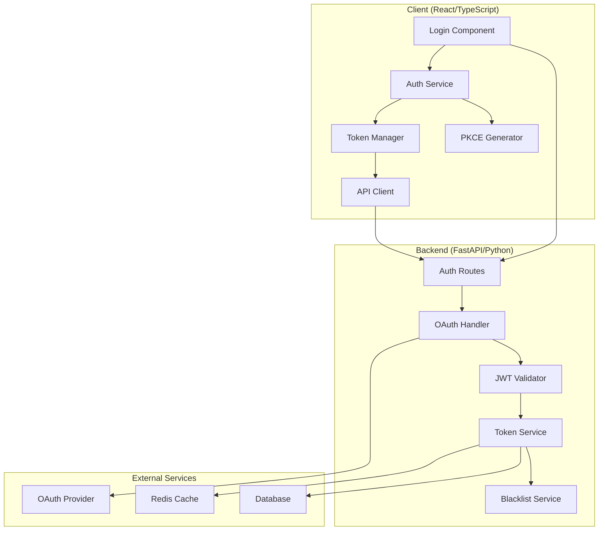
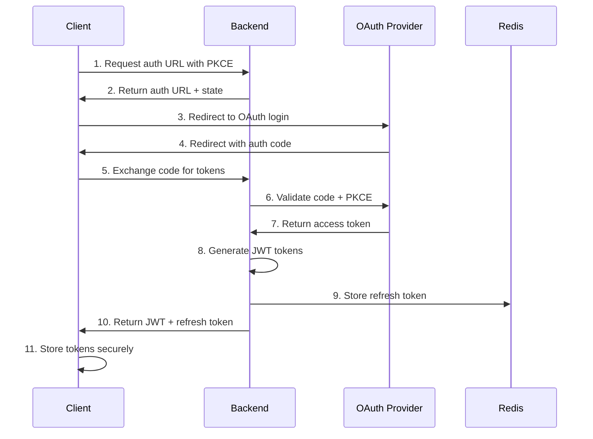

# SSO Implementation Guide
## Complete OAuth 2.0 + JWT Authentication System

### Table of Contents
1. [Architecture Overview](#architecture-overview)
2. [Backend Implementation](#backend-implementation)
3. [Frontend Implementation](#frontend-implementation)
4. [Security Features](#security-features)
5. [Configuration Guide](#configuration-guide)
6. [Integration Patterns](#integration-patterns)
7. [Best Practices](#best-practices)
8. [Troubleshooting](#troubleshooting)

---

## Architecture Overview

### System Architecture



### Authentication Flow



---

## Backend Implementation

### 1. Directory Structure

```
backend/
├── app/
│   ├── auth/
│   │   ├── __init__.py
│   │   ├── oauth.py          # OAuth 2.0 implementation
│   │   ├── jwt_handler.py    # JWT token management
│   │   ├── token_service.py  # Token rotation service
│   │   └── blacklist.py      # Token blacklisting
│   ├── middleware/
│   │   ├── auth.py           # Authentication middleware
│   │   ├── csrf.py           # CSRF protection
│   │   └── rate_limit.py     # Rate limiting
│   ├── models/
│   │   ├── user.py           # User models
│   │   └── session.py        # Session models
│   └── routers/
│       └── auth.py           # Authentication routes
```

### 2. OAuth 2.0 Implementation

**File: `app/auth/oauth.py`**

```python
import secrets
import hashlib
import base64
from typing import Optional, Dict, Any
from fastapi import HTTPException
import httpx
from pydantic import BaseModel

class PKCEChallenge(BaseModel):
    code_verifier: str
    code_challenge: str
    state: str

class OAuthHandler:
    def __init__(self, client_id: str, client_secret: str, redirect_uri: str, auth_url: str, token_url: str):
        self.client_id = client_id
        self.client_secret = client_secret
        self.redirect_uri = redirect_uri
        self.auth_url = auth_url
        self.token_url = token_url
    
    def generate_pkce_challenge(self) -> PKCEChallenge:
        """Generate PKCE challenge for OAuth 2.0 flow"""
        # Generate code verifier (43-128 characters)
        code_verifier = base64.urlsafe_b64encode(secrets.token_bytes(32)).decode('utf-8').rstrip('=')
        
        # Generate code challenge (SHA256 hash of verifier)
        code_challenge = base64.urlsafe_b64encode(
            hashlib.sha256(code_verifier.encode('utf-8')).digest()
        ).decode('utf-8').rstrip('=')
        
        # Generate state for CSRF protection
        state = secrets.token_urlsafe(32)
        
        return PKCEChallenge(
            code_verifier=code_verifier,
            code_challenge=code_challenge,
            state=state
        )
    
    def get_authorization_url(self, pkce: PKCEChallenge, scopes: Optional[str] = None) -> str:
        """Generate OAuth authorization URL"""
        params = {
            'response_type': 'code',
            'client_id': self.client_id,
            'redirect_uri': self.redirect_uri,
            'code_challenge': pkce.code_challenge,
            'code_challenge_method': 'S256',
            'state': pkce.state,
            'scope': scopes or 'openid profile email'
        }
        
        query_string = '&'.join([f"{k}={v}" for k, v in params.items()])
        return f"{self.auth_url}?{query_string}"
    
    async def exchange_code_for_token(self, code: str, code_verifier: str) -> Dict[str, Any]:
        """Exchange authorization code for access token"""
        async with httpx.AsyncClient() as client:
            response = await client.post(
                self.token_url,
                data={
                    'grant_type': 'authorization_code',
                    'client_id': self.client_id,
                    'client_secret': self.client_secret,
                    'code': code,
                    'redirect_uri': self.redirect_uri,
                    'code_verifier': code_verifier
                },
                headers={'Content-Type': 'application/x-www-form-urlencoded'}
            )
            
            if response.status_code != 200:
                raise HTTPException(status_code=400, detail="Failed to exchange code for token")
            
            return response.json()
    
    async def refresh_access_token(self, refresh_token: str) -> Dict[str, Any]:
        """Refresh access token using refresh token"""
        async with httpx.AsyncClient() as client:
            response = await client.post(
                self.token_url,
                data={
                    'grant_type': 'refresh_token',
                    'client_id': self.client_id,
                    'client_secret': self.client_secret,
                    'refresh_token': refresh_token
                },
                headers={'Content-Type': 'application/x-www-form-urlencoded'}
            )
            
            if response.status_code != 200:
                raise HTTPException(status_code=400, detail="Failed to refresh token")
            
            return response.json()
```

### 3. JWT Token Management

**File: `app/auth/jwt_handler.py`**

```python
import jwt
from datetime import datetime, timedelta, timezone
from typing import Optional, Dict, Any
from cryptography.hazmat.primitives import serialization
from cryptography.hazmat.primitives.asymmetric import rsa
import secrets

class JWTHandler:
    def __init__(self, 
                 private_key: str,
                 public_key: str,
                 algorithm: str = 'RS256',
                 access_token_expire_minutes: int = 15,
                 refresh_token_expire_days: int = 7):
        self.private_key = serialization.load_pem_private_key(
            private_key.encode(), password=None
        )
        self.public_key = serialization.load_pem_public_key(public_key.encode())
        self.algorithm = algorithm
        self.access_token_expire_minutes = access_token_expire_minutes
        self.refresh_token_expire_days = refresh_token_expire_days
    
    def create_access_token(self, user_data: Dict[str, Any]) -> str:
        """Create JWT access token"""
        now = datetime.now(timezone.utc)
        expire = now + timedelta(minutes=self.access_token_expire_minutes)
        
        payload = {
            'sub': user_data['user_id'],
            'email': user_data['email'],
            'name': user_data['name'],
            'roles': user_data.get('roles', []),
            'iat': now,
            'exp': expire,
            'iss': 'maxlab-platform',
            'aud': 'maxlab-api',
            'jti': secrets.token_urlsafe(16),  # JWT ID for tracking
            'type': 'access'
        }
        
        return jwt.encode(payload, self.private_key, algorithm=self.algorithm)
    
    def create_refresh_token(self, user_id: str) -> str:
        """Create JWT refresh token"""
        now = datetime.now(timezone.utc)
        expire = now + timedelta(days=self.refresh_token_expire_days)
        
        payload = {
            'sub': user_id,
            'iat': now,
            'exp': expire,
            'iss': 'maxlab-platform',
            'aud': 'maxlab-api',
            'jti': secrets.token_urlsafe(16),
            'type': 'refresh'
        }
        
        return jwt.encode(payload, self.private_key, algorithm=self.algorithm)
    
    def verify_token(self, token: str) -> Dict[str, Any]:
        """Verify and decode JWT token"""
        try:
            payload = jwt.decode(
                token, 
                self.public_key, 
                algorithms=[self.algorithm],
                audience='maxlab-api',
                issuer='maxlab-platform'
            )
            return payload
        except jwt.ExpiredSignatureError:
            raise HTTPException(status_code=401, detail="Token has expired")
        except jwt.InvalidTokenError:
            raise HTTPException(status_code=401, detail="Invalid token")
    
    def extract_token_id(self, token: str) -> Optional[str]:
        """Extract token ID without full verification"""
        try:
            unverified = jwt.decode(token, options={"verify_signature": False})
            return unverified.get('jti')
        except:
            return None
```

### 4. Token Rotation Service

**File: `app/auth/token_service.py`**

```python
import redis
import json
from datetime import datetime, timedelta, timezone
from typing import Optional, Dict, Any, Tuple
from .jwt_handler import JWTHandler
from .blacklist import TokenBlacklistService

class TokenRotationService:
    def __init__(self, jwt_handler: JWTHandler, redis_client: redis.Redis, blacklist_service: TokenBlacklistService):
        self.jwt_handler = jwt_handler
        self.redis = redis_client
        self.blacklist = blacklist_service
        self.refresh_token_prefix = "refresh_token:"
        self.user_sessions_prefix = "user_sessions:"
    
    async def create_token_pair(self, user_data: Dict[str, Any]) -> Tuple[str, str]:
        """Create access and refresh token pair"""
        access_token = self.jwt_handler.create_access_token(user_data)
        refresh_token = self.jwt_handler.create_refresh_token(user_data['user_id'])
        
        # Store refresh token in Redis with expiration
        refresh_payload = self.jwt_handler.verify_token(refresh_token)
        expire_time = datetime.fromtimestamp(refresh_payload['exp'], tz=timezone.utc)
        ttl = int((expire_time - datetime.now(timezone.utc)).total_seconds())
        
        refresh_key = f"{self.refresh_token_prefix}{refresh_payload['jti']}"
        token_data = {
            'user_id': user_data['user_id'],
            'created_at': datetime.now(timezone.utc).isoformat(),
            'last_used': datetime.now(timezone.utc).isoformat(),
            'user_agent': user_data.get('user_agent', ''),
            'ip_address': user_data.get('ip_address', ''),
            'session_id': refresh_payload['jti']
        }
        
        self.redis.setex(refresh_key, ttl, json.dumps(token_data))
        
        # Track user sessions
        await self._track_user_session(user_data['user_id'], refresh_payload['jti'])
        
        return access_token, refresh_token
    
    async def rotate_tokens(self, refresh_token: str, user_agent: str = '', ip_address: str = '') -> Tuple[str, str]:
        """Rotate access and refresh tokens"""
        try:
            # Verify refresh token
            refresh_payload = self.jwt_handler.verify_token(refresh_token)
            
            if refresh_payload['type'] != 'refresh':
                raise HTTPException(status_code=401, detail="Invalid token type")
            
            # Check if token is blacklisted
            if await self.blacklist.is_blacklisted(refresh_payload['jti']):
                raise HTTPException(status_code=401, detail="Token has been revoked")
            
            # Verify token exists in Redis
            refresh_key = f"{self.refresh_token_prefix}{refresh_payload['jti']}"
            token_data = self.redis.get(refresh_key)
            
            if not token_data:
                raise HTTPException(status_code=401, detail="Refresh token not found")
            
            token_info = json.loads(token_data)
            user_id = refresh_payload['sub']
            
            # Get current user data (you'll need to implement this based on your user service)
            user_data = await self._get_user_data(user_id)
            user_data.update({
                'user_agent': user_agent,
                'ip_address': ip_address
            })
            
            # Create new token pair
            new_access_token, new_refresh_token = await self.create_token_pair(user_data)
            
            # Blacklist old refresh token
            await self.blacklist.add_to_blacklist(refresh_payload['jti'], refresh_payload['exp'])
            
            # Remove old refresh token from Redis
            self.redis.delete(refresh_key)
            
            # Update session tracking
            await self._update_session_tracking(user_id, refresh_payload['jti'])
            
            return new_access_token, new_refresh_token
            
        except jwt.ExpiredSignatureError:
            raise HTTPException(status_code=401, detail="Refresh token has expired")
        except jwt.InvalidTokenError:
            raise HTTPException(status_code=401, detail="Invalid refresh token")
    
    async def revoke_token(self, refresh_token: str) -> bool:
        """Revoke a refresh token"""
        try:
            refresh_payload = self.jwt_handler.verify_token(refresh_token)
            
            # Add to blacklist
            await self.blacklist.add_to_blacklist(refresh_payload['jti'], refresh_payload['exp'])
            
            # Remove from Redis
            refresh_key = f"{self.refresh_token_prefix}{refresh_payload['jti']}"
            self.redis.delete(refresh_key)
            
            # Update session tracking
            await self._remove_user_session(refresh_payload['sub'], refresh_payload['jti'])
            
            return True
        except:
            return False
    
    async def revoke_all_user_tokens(self, user_id: str) -> bool:
        """Revoke all tokens for a user"""
        try:
            # Get all user sessions
            sessions_key = f"{self.user_sessions_prefix}{user_id}"
            session_ids = self.redis.smembers(sessions_key)
            
            for session_id in session_ids:
                session_id = session_id.decode('utf-8')
                refresh_key = f"{self.refresh_token_prefix}{session_id}"
                
                # Get token data to extract expiration
                token_data = self.redis.get(refresh_key)
                if token_data:
                    # Add to blacklist (you'll need to get the actual expiration)
                    expire_time = int((datetime.now(timezone.utc) + timedelta(days=7)).timestamp())
                    await self.blacklist.add_to_blacklist(session_id, expire_time)
                
                # Remove from Redis
                self.redis.delete(refresh_key)
            
            # Clear user sessions
            self.redis.delete(sessions_key)
            
            return True
        except:
            return False
    
    async def _track_user_session(self, user_id: str, session_id: str):
        """Track user session in Redis set"""
        sessions_key = f"{self.user_sessions_prefix}{user_id}"
        self.redis.sadd(sessions_key, session_id)
        # Set expiration for the sessions set (longer than refresh token)
        self.redis.expire(sessions_key, timedelta(days=30).total_seconds())
    
    async def _update_session_tracking(self, user_id: str, old_session_id: str):
        """Update session tracking when rotating tokens"""
        sessions_key = f"{self.user_sessions_prefix}{user_id}"
        self.redis.srem(sessions_key, old_session_id)
    
    async def _remove_user_session(self, user_id: str, session_id: str):
        """Remove specific user session"""
        sessions_key = f"{self.user_sessions_prefix}{user_id}"
        self.redis.srem(sessions_key, session_id)
    
    async def _get_user_data(self, user_id: str) -> Dict[str, Any]:
        """Get user data - implement based on your user service"""
        # This is a placeholder - implement based on your user model
        return {
            'user_id': user_id,
            'email': 'user@example.com',
            'name': 'User Name',
            'roles': ['user']
        }
```

### 5. Token Blacklisting Service

**File: `app/auth/blacklist.py`**

```python
import redis
from datetime import datetime, timezone
from typing import Set

class TokenBlacklistService:
    def __init__(self, redis_client: redis.Redis):
        self.redis = redis_client
        self.blacklist_prefix = "blacklist:"
    
    async def add_to_blacklist(self, token_id: str, expiration_timestamp: int):
        """Add token to blacklist with expiration"""
        key = f"{self.blacklist_prefix}{token_id}"
        
        # Calculate TTL based on token expiration
        now = int(datetime.now(timezone.utc).timestamp())
        ttl = max(expiration_timestamp - now, 0)
        
        if ttl > 0:
            self.redis.setex(key, ttl, "blacklisted")
    
    async def is_blacklisted(self, token_id: str) -> bool:
        """Check if token is blacklisted"""
        key = f"{self.blacklist_prefix}{token_id}"
        return self.redis.exists(key) > 0
    
    async def remove_from_blacklist(self, token_id: str):
        """Remove token from blacklist (for admin purposes)"""
        key = f"{self.blacklist_prefix}{token_id}"
        self.redis.delete(key)
    
    async def get_blacklisted_tokens(self) -> Set[str]:
        """Get all blacklisted token IDs (for debugging)"""
        pattern = f"{self.blacklist_prefix}*"
        keys = self.redis.keys(pattern)
        return {key.decode('utf-8').replace(self.blacklist_prefix, '') for key in keys}
```

### 6. Authentication Middleware

**File: `app/middleware/auth.py`**

```python
from fastapi import Request, HTTPException, Depends
from fastapi.security import HTTPBearer, HTTPAuthorizationCredentials
from typing import Optional, Dict, Any
from ..auth.jwt_handler import JWTHandler
from ..auth.blacklist import TokenBlacklistService

security = HTTPBearer()

class AuthMiddleware:
    def __init__(self, jwt_handler: JWTHandler, blacklist_service: TokenBlacklistService):
        self.jwt_handler = jwt_handler
        self.blacklist = blacklist_service
    
    async def verify_token(self, credentials: HTTPAuthorizationCredentials = Depends(security)) -> Dict[str, Any]:
        """Verify JWT access token"""
        token = credentials.credentials
        
        # Verify token signature and claims
        payload = self.jwt_handler.verify_token(token)
        
        # Check token type
        if payload.get('type') != 'access':
            raise HTTPException(status_code=401, detail="Invalid token type")
        
        # Check if token is blacklisted
        token_id = payload.get('jti')
        if token_id and await self.blacklist.is_blacklisted(token_id):
            raise HTTPException(status_code=401, detail="Token has been revoked")
        
        return payload
    
    async def get_current_user(self, token_payload: Dict[str, Any] = Depends(verify_token)) -> Dict[str, Any]:
        """Get current user from token payload"""
        return {
            'user_id': token_payload['sub'],
            'email': token_payload['email'],
            'name': token_payload['name'],
            'roles': token_payload.get('roles', [])
        }
    
    async def require_roles(self, required_roles: list[str]):
        """Dependency to require specific roles"""
        def check_roles(current_user: Dict[str, Any] = Depends(self.get_current_user)) -> Dict[str, Any]:
            user_roles = current_user.get('roles', [])
            if not any(role in user_roles for role in required_roles):
                raise HTTPException(status_code=403, detail="Insufficient permissions")
            return current_user
        return check_roles

# Create global instances (configure with your actual dependencies)
auth_middleware = AuthMiddleware(jwt_handler, blacklist_service)
```

### 7. Authentication Routes

**File: `app/routers/auth.py`**

```python
from fastapi import APIRouter, Depends, HTTPException, Request, Response
from fastapi.responses import RedirectResponse
from pydantic import BaseModel
from typing import Dict, Any
from ..auth.oauth import OAuthHandler, PKCEChallenge
from ..auth.token_service import TokenRotationService
from ..middleware.auth import auth_middleware
import redis

router = APIRouter(prefix="/auth", tags=["authentication"])

class TokenRequest(BaseModel):
    code: str
    state: str
    code_verifier: str

class RefreshTokenRequest(BaseModel):
    refresh_token: str

class TokenResponse(BaseModel):
    access_token: str
    refresh_token: str
    token_type: str = "bearer"
    expires_in: int

@router.get("/login")
async def get_login_url(request: Request):
    """Get OAuth login URL with PKCE challenge"""
    oauth_handler = OAuthHandler(
        client_id="your_client_id",
        client_secret="your_client_secret",
        redirect_uri="your_redirect_uri",
        auth_url="https://oauth.provider.com/auth",
        token_url="https://oauth.provider.com/token"
    )
    
    # Generate PKCE challenge
    pkce = oauth_handler.generate_pkce_challenge()
    
    # Store PKCE data in session (you might use Redis for this)
    # For demo purposes, we'll return it - in production, store securely
    auth_url = oauth_handler.get_authorization_url(pkce)
    
    return {
        "auth_url": auth_url,
        "code_verifier": pkce.code_verifier,  # Store this securely on client
        "state": pkce.state
    }

@router.post("/token", response_model=TokenResponse)
async def exchange_token(token_request: TokenRequest, request: Request):
    """Exchange authorization code for JWT tokens"""
    oauth_handler = OAuthHandler(
        client_id="your_client_id",
        client_secret="your_client_secret",
        redirect_uri="your_redirect_uri",
        auth_url="https://oauth.provider.com/auth",
        token_url="https://oauth.provider.com/token"
    )
    
    try:
        # Exchange code for OAuth token
        oauth_token = await oauth_handler.exchange_code_for_token(
            token_request.code, 
            token_request.code_verifier
        )
        
        # Extract user info from OAuth token (implement based on your OAuth provider)
        user_data = await extract_user_info(oauth_token['access_token'])
        
        # Add request metadata
        user_data.update({
            'user_agent': request.headers.get('user-agent', ''),
            'ip_address': request.client.host
        })
        
        # Create JWT token pair
        token_service = TokenRotationService(jwt_handler, redis_client, blacklist_service)
        access_token, refresh_token = await token_service.create_token_pair(user_data)
        
        return TokenResponse(
            access_token=access_token,
            refresh_token=refresh_token,
            expires_in=900  # 15 minutes
        )
        
    except Exception as e:
        raise HTTPException(status_code=400, detail=str(e))

@router.post("/refresh", response_model=TokenResponse)
async def refresh_token(refresh_request: RefreshTokenRequest, request: Request):
    """Refresh access token using refresh token"""
    token_service = TokenRotationService(jwt_handler, redis_client, blacklist_service)
    
    try:
        access_token, new_refresh_token = await token_service.rotate_tokens(
            refresh_request.refresh_token,
            user_agent=request.headers.get('user-agent', ''),
            ip_address=request.client.host
        )
        
        return TokenResponse(
            access_token=access_token,
            refresh_token=new_refresh_token,
            expires_in=900
        )
        
    except Exception as e:
        raise HTTPException(status_code=401, detail=str(e))

@router.post("/logout")
async def logout(refresh_request: RefreshTokenRequest):
    """Logout and revoke refresh token"""
    token_service = TokenRotationService(jwt_handler, redis_client, blacklist_service)
    
    success = await token_service.revoke_token(refresh_request.refresh_token)
    
    if success:
        return {"message": "Successfully logged out"}
    else:
        raise HTTPException(status_code=400, detail="Failed to logout")

@router.post("/logout-all")
async def logout_all_devices(current_user: Dict[str, Any] = Depends(auth_middleware.get_current_user)):
    """Logout from all devices"""
    token_service = TokenRotationService(jwt_handler, redis_client, blacklist_service)
    
    success = await token_service.revoke_all_user_tokens(current_user['user_id'])
    
    if success:
        return {"message": "Successfully logged out from all devices"}
    else:
        raise HTTPException(status_code=400, detail="Failed to logout from all devices")

@router.get("/me")
async def get_current_user(current_user: Dict[str, Any] = Depends(auth_middleware.get_current_user)):
    """Get current user information"""
    return current_user

async def extract_user_info(oauth_access_token: str) -> Dict[str, Any]:
    """Extract user information from OAuth access token"""
    # Implement based on your OAuth provider's user info endpoint
    # This is a placeholder implementation
    return {
        'user_id': 'user123',
        'email': 'user@example.com',
        'name': 'John Doe',
        'roles': ['user']
    }
```

---

## Frontend Implementation

### 1. Directory Structure

```
frontend/src/
├── auth/
│   ├── AuthService.ts      # Main authentication service
│   ├── TokenManager.ts     # Token storage and rotation
│   ├── PKCEHelper.ts       # PKCE implementation
│   └── AuthContext.tsx     # React context for auth state
├── api/
│   ├── client.ts           # API client with auth interceptors
│   └── interceptors.ts     # Request/response interceptors
├── components/
│   ├── Login.tsx           # Login component
│   ├── ProtectedRoute.tsx  # Route protection
│   └── AuthGuard.tsx       # Authentication guard
└── hooks/
    ├── useAuth.ts          # Authentication hook
    └── useTokenRefresh.ts  # Token refresh hook
```

### 2. PKCE Helper Implementation

**File: `src/auth/PKCEHelper.ts`**

```typescript
import CryptoJS from 'crypto-js';

export interface PKCEChallenge {
  codeVerifier: string;
  codeChallenge: string;
  state: string;
}

export class PKCEHelper {
  /**
   * Generate PKCE challenge for OAuth 2.0 flow
   */
  static generateChallenge(): PKCEChallenge {
    // Generate code verifier (43-128 characters)
    const codeVerifier = this.generateCodeVerifier();
    
    // Generate code challenge (SHA256 hash of verifier)
    const codeChallenge = this.generateCodeChallenge(codeVerifier);
    
    // Generate state for CSRF protection
    const state = this.generateState();
    
    return {
      codeVerifier,
      codeChallenge,
      state
    };
  }
  
  private static generateCodeVerifier(): string {
    const array = new Uint8Array(32);
    crypto.getRandomValues(array);
    return this.base64URLEncode(array);
  }
  
  private static generateCodeChallenge(verifier: string): string {
    const hash = CryptoJS.SHA256(verifier);
    const hashArray = new Uint8Array(hash.words.length * 4);
    
    for (let i = 0; i < hash.words.length; i++) {
      const word = hash.words[i];
      hashArray[i * 4] = (word >>> 24) & 0xff;
      hashArray[i * 4 + 1] = (word >>> 16) & 0xff;
      hashArray[i * 4 + 2] = (word >>> 8) & 0xff;
      hashArray[i * 4 + 3] = word & 0xff;
    }
    
    return this.base64URLEncode(hashArray);
  }
  
  private static generateState(): string {
    const array = new Uint8Array(32);
    crypto.getRandomValues(array);
    return this.base64URLEncode(array);
  }
  
  private static base64URLEncode(array: Uint8Array): string {
    const base64 = btoa(String.fromCharCode(...array));
    return base64.replace(/\+/g, '-').replace(/\//g, '_').replace(/=/g, '');
  }
  
  /**
   * Validate state parameter for CSRF protection
   */
  static validateState(receivedState: string, expectedState: string): boolean {
    return receivedState === expectedState;
  }
}
```

### 3. Token Manager

**File: `src/auth/TokenManager.ts`**

```typescript
import CryptoJS from 'crypto-js';

export interface TokenPair {
  accessToken: string;
  refreshToken: string;
  expiresIn: number;
  tokenType: string;
}

export interface StoredTokenData {
  accessToken: string;
  refreshToken: string;
  expiresAt: number;
  refreshExpiresAt: number;
  tokenType: string;
}

export class TokenManager {
  private static readonly ACCESS_TOKEN_KEY = 'maxlab_access_token';
  private static readonly REFRESH_TOKEN_KEY = 'maxlab_refresh_token';
  private static readonly TOKEN_DATA_KEY = 'maxlab_token_data';
  private static readonly ENCRYPTION_KEY = 'maxlab_encryption_key';
  
  private encryptionKey: string;
  
  constructor(encryptionKey?: string) {
    this.encryptionKey = encryptionKey || this.getOrCreateEncryptionKey();
  }
  
  /**
   * Store token pair securely
   */
  storeTokens(tokenPair: TokenPair): void {
    const now = Date.now();
    const accessExpiresAt = now + (tokenPair.expiresIn * 1000);
    const refreshExpiresAt = now + (7 * 24 * 60 * 60 * 1000); // 7 days
    
    const tokenData: StoredTokenData = {
      accessToken: tokenPair.accessToken,
      refreshToken: tokenPair.refreshToken,
      expiresAt: accessExpiresAt,
      refreshExpiresAt: refreshExpiresAt,
      tokenType: tokenPair.tokenType
    };
    
    // Encrypt sensitive data
    const encryptedAccessToken = this.encrypt(tokenPair.accessToken);
    const encryptedRefreshToken = this.encrypt(tokenPair.refreshToken);
    const encryptedTokenData = this.encrypt(JSON.stringify(tokenData));
    
    // Store in localStorage with encryption
    localStorage.setItem(this.ACCESS_TOKEN_KEY, encryptedAccessToken);
    localStorage.setItem(this.REFRESH_TOKEN_KEY, encryptedRefreshToken);
    localStorage.setItem(this.TOKEN_DATA_KEY, encryptedTokenData);
    
    // Also store access token in memory for faster access
    this.memoryAccessToken = tokenPair.accessToken;
  }
  
  /**
   * Get access token
   */
  getAccessToken(): string | null {
    // First try memory
    if (this.memoryAccessToken && !this.isAccessTokenExpired()) {
      return this.memoryAccessToken;
    }
    
    // Then try localStorage
    const encryptedToken = localStorage.getItem(this.ACCESS_TOKEN_KEY);
    if (!encryptedToken) return null;
    
    try {
      const decryptedToken = this.decrypt(encryptedToken);
      
      if (!this.isAccessTokenExpired()) {
        this.memoryAccessToken = decryptedToken;
        return decryptedToken;
      }
      
      return null;
    } catch {
      return null;
    }
  }
  
  /**
   * Get refresh token
   */
  getRefreshToken(): string | null {
    const encryptedToken = localStorage.getItem(this.REFRESH_TOKEN_KEY);
    if (!encryptedToken) return null;
    
    try {
      const decryptedToken = this.decrypt(encryptedToken);
      
      if (!this.isRefreshTokenExpired()) {
        return decryptedToken;
      }
      
      return null;
    } catch {
      return null;
    }
  }
  
  /**
   * Get stored token data
   */
  getTokenData(): StoredTokenData | null {
    const encryptedData = localStorage.getItem(this.TOKEN_DATA_KEY);
    if (!encryptedData) return null;
    
    try {
      const decryptedData = this.decrypt(encryptedData);
      return JSON.parse(decryptedData);
    } catch {
      return null;
    }
  }
  
  /**
   * Check if access token is expired
   */
  isAccessTokenExpired(): boolean {
    const tokenData = this.getTokenData();
    if (!tokenData) return true;
    
    // Add 1 minute buffer
    const buffer = 60 * 1000;
    return Date.now() >= (tokenData.expiresAt - buffer);
  }
  
  /**
   * Check if refresh token is expired
   */
  isRefreshTokenExpired(): boolean {
    const tokenData = this.getTokenData();
    if (!tokenData) return true;
    
    return Date.now() >= tokenData.refreshExpiresAt;
  }
  
  /**
   * Check if user is authenticated
   */
  isAuthenticated(): boolean {
    const accessToken = this.getAccessToken();
    const refreshToken = this.getRefreshToken();
    
    return !!(accessToken || refreshToken);
  }
  
  /**
   * Clear all tokens
   */
  clearTokens(): void {
    localStorage.removeItem(this.ACCESS_TOKEN_KEY);
    localStorage.removeItem(this.REFRESH_TOKEN_KEY);
    localStorage.removeItem(this.TOKEN_DATA_KEY);
    this.memoryAccessToken = null;
  }
  
  private memoryAccessToken: string | null = null;
  
  private encrypt(text: string): string {
    return CryptoJS.AES.encrypt(text, this.encryptionKey).toString();
  }
  
  private decrypt(ciphertext: string): string {
    const bytes = CryptoJS.AES.decrypt(ciphertext, this.encryptionKey);
    return bytes.toString(CryptoJS.enc.Utf8);
  }
  
  private getOrCreateEncryptionKey(): string {
    let key = localStorage.getItem(this.ENCRYPTION_KEY);
    
    if (!key) {
      // Generate a new encryption key
      const array = new Uint8Array(32);
      crypto.getRandomValues(array);
      key = btoa(String.fromCharCode(...array));
      localStorage.setItem(this.ENCRYPTION_KEY, key);
    }
    
    return key;
  }
}
```

### 4. Authentication Service

**File: `src/auth/AuthService.ts`**

```typescript
import { TokenManager, TokenPair } from './TokenManager';
import { PKCEHelper, PKCEChallenge } from './PKCEHelper';
import { apiClient } from '../api/client';

export interface User {
  userId: string;
  email: string;
  name: string;
  roles: string[];
}

export interface LoginUrlResponse {
  authUrl: string;
  codeVerifier: string;
  state: string;
}

export interface AuthCallbackParams {
  code: string;
  state: string;
}

export class AuthService {
  private tokenManager: TokenManager;
  private baseUrl: string;
  
  constructor(baseUrl: string) {
    this.baseUrl = baseUrl;
    this.tokenManager = new TokenManager();
  }
  
  /**
   * Get OAuth login URL
   */
  async getLoginUrl(): Promise<LoginUrlResponse> {
    const response = await fetch(`${this.baseUrl}/auth/login`);
    if (!response.ok) {
      throw new Error('Failed to get login URL');
    }
    
    return response.json();
  }
  
  /**
   * Handle OAuth callback and exchange code for tokens
   */
  async handleCallback(params: AuthCallbackParams, codeVerifier: string): Promise<User> {
    const response = await fetch(`${this.baseUrl}/auth/token`, {
      method: 'POST',
      headers: {
        'Content-Type': 'application/json',
      },
      body: JSON.stringify({
        code: params.code,
        state: params.state,
        code_verifier: codeVerifier,
      }),
    });
    
    if (!response.ok) {
      throw new Error('Failed to exchange code for tokens');
    }
    
    const tokenPair: TokenPair = await response.json();
    this.tokenManager.storeTokens(tokenPair);
    
    return this.getCurrentUser();
  }
  
  /**
   * Refresh access token
   */
  async refreshToken(): Promise<TokenPair> {
    const refreshToken = this.tokenManager.getRefreshToken();
    
    if (!refreshToken) {
      throw new Error('No refresh token available');
    }
    
    const response = await fetch(`${this.baseUrl}/auth/refresh`, {
      method: 'POST',
      headers: {
        'Content-Type': 'application/json',
      },
      body: JSON.stringify({
        refresh_token: refreshToken,
      }),
    });
    
    if (!response.ok) {
      // If refresh fails, clear tokens
      this.tokenManager.clearTokens();
      throw new Error('Failed to refresh token');
    }
    
    const tokenPair: TokenPair = await response.json();
    this.tokenManager.storeTokens(tokenPair);
    
    return tokenPair;
  }
  
  /**
   * Get current user information
   */
  async getCurrentUser(): Promise<User> {
    const accessToken = await this.getValidAccessToken();
    
    const response = await fetch(`${this.baseUrl}/auth/me`, {
      headers: {
        'Authorization': `Bearer ${accessToken}`,
      },
    });
    
    if (!response.ok) {
      throw new Error('Failed to get user information');
    }
    
    return response.json();
  }
  
  /**
   * Logout from current device
   */
  async logout(): Promise<void> {
    const refreshToken = this.tokenManager.getRefreshToken();
    
    if (refreshToken) {
      try {
        await fetch(`${this.baseUrl}/auth/logout`, {
          method: 'POST',
          headers: {
            'Content-Type': 'application/json',
          },
          body: JSON.stringify({
            refresh_token: refreshToken,
          }),
        });
      } catch {
        // Continue with local logout even if server logout fails
      }
    }
    
    this.tokenManager.clearTokens();
  }
  
  /**
   * Logout from all devices
   */
  async logoutAllDevices(): Promise<void> {
    const accessToken = await this.getValidAccessToken();
    
    await fetch(`${this.baseUrl}/auth/logout-all`, {
      method: 'POST',
      headers: {
        'Authorization': `Bearer ${accessToken}`,
      },
    });
    
    this.tokenManager.clearTokens();
  }
  
  /**
   * Check if user is authenticated
   */
  isAuthenticated(): boolean {
    return this.tokenManager.isAuthenticated();
  }
  
  /**
   * Get valid access token (refresh if needed)
   */
  async getValidAccessToken(): Promise<string> {
    let accessToken = this.tokenManager.getAccessToken();
    
    if (!accessToken || this.tokenManager.isAccessTokenExpired()) {
      // Try to refresh token
      try {
        await this.refreshToken();
        accessToken = this.tokenManager.getAccessToken();
      } catch {
        throw new Error('Unable to get valid access token');
      }
    }
    
    if (!accessToken) {
      throw new Error('No access token available');
    }
    
    return accessToken;
  }
  
  /**
   * Silent authentication check
   */
  async silentAuth(): Promise<User | null> {
    try {
      if (this.tokenManager.isAuthenticated()) {
        return await this.getCurrentUser();
      }
      return null;
    } catch {
      return null;
    }
  }
}
```

### 5. API Client with Interceptors

**File: `src/api/client.ts`**

```typescript
import axios, { AxiosInstance, AxiosRequestConfig, AxiosResponse } from 'axios';
import { AuthService } from '../auth/AuthService';

export interface ApiClientConfig {
  baseURL: string;
  timeout?: number;
}

export class ApiClient {
  private instance: AxiosInstance;
  private authService: AuthService;
  private isRefreshing = false;
  private failedQueue: Array<{
    resolve: (token: string) => void;
    reject: (error: any) => void;
  }> = [];
  
  constructor(config: ApiClientConfig, authService: AuthService) {
    this.authService = authService;
    
    this.instance = axios.create({
      baseURL: config.baseURL,
      timeout: config.timeout || 10000,
      headers: {
        'Content-Type': 'application/json',
      },
    });
    
    this.setupInterceptors();
  }
  
  private setupInterceptors(): void {
    // Request interceptor - add auth token
    this.instance.interceptors.request.use(
      async (config) => {
        try {
          const token = await this.authService.getValidAccessToken();
          if (token) {
            config.headers.Authorization = `Bearer ${token}`;
          }
        } catch {
          // Continue without token for public endpoints
        }
        
        return config;
      },
      (error) => {
        return Promise.reject(error);
      }
    );
    
    // Response interceptor - handle token refresh
    this.instance.interceptors.response.use(
      (response) => response,
      async (error) => {
        const originalRequest = error.config;
        
        if (error.response?.status === 401 && !originalRequest._retry) {
          if (this.isRefreshing) {
            // If already refreshing, queue the request
            return new Promise((resolve, reject) => {
              this.failedQueue.push({ resolve, reject });
            }).then((token) => {
              originalRequest.headers.Authorization = `Bearer ${token}`;
              return this.instance(originalRequest);
            }).catch((err) => {
              return Promise.reject(err);
            });
          }
          
          originalRequest._retry = true;
          this.isRefreshing = true;
          
          try {
            await this.authService.refreshToken();
            const newToken = await this.authService.getValidAccessToken();
            
            // Process queued requests
            this.processQueue(null, newToken);
            
            // Retry original request
            originalRequest.headers.Authorization = `Bearer ${newToken}`;
            return this.instance(originalRequest);
          } catch (refreshError) {
            // Refresh failed, process queue with error
            this.processQueue(refreshError, null);
            
            // Redirect to login or handle authentication failure
            this.handleAuthenticationFailure();
            
            return Promise.reject(refreshError);
          } finally {
            this.isRefreshing = false;
          }
        }
        
        return Promise.reject(error);
      }
    );
  }
  
  private processQueue(error: any, token: string | null): void {
    this.failedQueue.forEach(({ resolve, reject }) => {
      if (error) {
        reject(error);
      } else {
        resolve(token!);
      }
    });
    
    this.failedQueue = [];
  }
  
  private handleAuthenticationFailure(): void {
    // Clear tokens
    this.authService.logout();
    
    // Redirect to login page or emit event
    window.dispatchEvent(new CustomEvent('auth:logout'));
  }
  
  // Expose axios methods
  async get<T>(url: string, config?: AxiosRequestConfig): Promise<AxiosResponse<T>> {
    return this.instance.get(url, config);
  }
  
  async post<T>(url: string, data?: any, config?: AxiosRequestConfig): Promise<AxiosResponse<T>> {
    return this.instance.post(url, data, config);
  }
  
  async put<T>(url: string, data?: any, config?: AxiosRequestConfig): Promise<AxiosResponse<T>> {
    return this.instance.put(url, data, config);
  }
  
  async delete<T>(url: string, config?: AxiosRequestConfig): Promise<AxiosResponse<T>> {
    return this.instance.delete(url, config);
  }
  
  async patch<T>(url: string, data?: any, config?: AxiosRequestConfig): Promise<AxiosResponse<T>> {
    return this.instance.patch(url, data, config);
  }
}

// Export singleton instance
export const apiClient = new ApiClient(
  { baseURL: process.env.REACT_APP_API_URL || 'http://localhost:8000' },
  new AuthService(process.env.REACT_APP_API_URL || 'http://localhost:8000')
);
```

### 6. React Authentication Context

**File: `src/auth/AuthContext.tsx`**

```typescript
import React, { createContext, useContext, useEffect, useState, ReactNode } from 'react';
import { AuthService, User } from './AuthService';

interface AuthContextType {
  user: User | null;
  isLoading: boolean;
  isAuthenticated: boolean;
  login: () => Promise<void>;
  logout: () => Promise<void>;
  logoutAllDevices: () => Promise<void>;
  refreshUser: () => Promise<void>;
}

const AuthContext = createContext<AuthContextType | null>(null);

interface AuthProviderProps {
  children: ReactNode;
  authService: AuthService;
}

export const AuthProvider: React.FC<AuthProviderProps> = ({ children, authService }) => {
  const [user, setUser] = useState<User | null>(null);
  const [isLoading, setIsLoading] = useState(true);
  const [isAuthenticated, setIsAuthenticated] = useState(false);
  
  useEffect(() => {
    initializeAuth();
    
    // Listen for authentication events
    const handleAuthLogout = () => {
      setUser(null);
      setIsAuthenticated(false);
    };
    
    window.addEventListener('auth:logout', handleAuthLogout);
    
    return () => {
      window.removeEventListener('auth:logout', handleAuthLogout);
    };
  }, []);
  
  const initializeAuth = async () => {
    try {
      setIsLoading(true);
      
      if (authService.isAuthenticated()) {
        const currentUser = await authService.silentAuth();
        if (currentUser) {
          setUser(currentUser);
          setIsAuthenticated(true);
        }
      }
    } catch (error) {
      console.error('Failed to initialize authentication:', error);
    } finally {
      setIsLoading(false);
    }
  };
  
  const login = async () => {
    try {
      const loginData = await authService.getLoginUrl();
      
      // Store PKCE data for callback
      sessionStorage.setItem('auth_code_verifier', loginData.codeVerifier);
      sessionStorage.setItem('auth_state', loginData.state);
      
      // Redirect to OAuth provider
      window.location.href = loginData.authUrl;
    } catch (error) {
      console.error('Login failed:', error);
      throw error;
    }
  };
  
  const logout = async () => {
    try {
      await authService.logout();
      setUser(null);
      setIsAuthenticated(false);
    } catch (error) {
      console.error('Logout failed:', error);
      // Still clear local state even if server logout fails
      setUser(null);
      setIsAuthenticated(false);
    }
  };
  
  const logoutAllDevices = async () => {
    try {
      await authService.logoutAllDevices();
      setUser(null);
      setIsAuthenticated(false);
    } catch (error) {
      console.error('Logout all devices failed:', error);
      throw error;
    }
  };
  
  const refreshUser = async () => {
    try {
      const currentUser = await authService.getCurrentUser();
      setUser(currentUser);
      setIsAuthenticated(true);
    } catch (error) {
      console.error('Failed to refresh user:', error);
      setUser(null);
      setIsAuthenticated(false);
    }
  };
  
  const contextValue: AuthContextType = {
    user,
    isLoading,
    isAuthenticated,
    login,
    logout,
    logoutAllDevices,
    refreshUser,
  };
  
  return (
    <AuthContext.Provider value={contextValue}>
      {children}
    </AuthContext.Provider>
  );
};

export const useAuth = (): AuthContextType => {
  const context = useContext(AuthContext);
  if (!context) {
    throw new Error('useAuth must be used within an AuthProvider');
  }
  return context;
};
```

### 7. Authentication Callback Handler

**File: `src/components/AuthCallback.tsx`**

```typescript
import React, { useEffect, useState } from 'react';
import { useNavigate, useSearchParams } from 'react-router-dom';
import { useAuth } from '../auth/AuthContext';
import { PKCEHelper } from '../auth/PKCEHelper';

export const AuthCallback: React.FC = () => {
  const [searchParams] = useSearchParams();
  const navigate = useNavigate();
  const { refreshUser } = useAuth();
  const [isProcessing, setIsProcessing] = useState(true);
  const [error, setError] = useState<string | null>(null);
  
  useEffect(() => {
    handleCallback();
  }, []);
  
  const handleCallback = async () => {
    try {
      const code = searchParams.get('code');
      const state = searchParams.get('state');
      const error = searchParams.get('error');
      
      if (error) {
        throw new Error(`OAuth error: ${error}`);
      }
      
      if (!code || !state) {
        throw new Error('Missing authorization code or state parameter');
      }
      
      // Get stored PKCE data
      const codeVerifier = sessionStorage.getItem('auth_code_verifier');
      const expectedState = sessionStorage.getItem('auth_state');
      
      if (!codeVerifier || !expectedState) {
        throw new Error('Missing PKCE data. Please try logging in again.');
      }
      
      // Validate state for CSRF protection
      if (!PKCEHelper.validateState(state, expectedState)) {
        throw new Error('Invalid state parameter. Possible CSRF attack.');
      }
      
      // Exchange code for tokens
      const authService = new AuthService(process.env.REACT_APP_API_URL || 'http://localhost:8000');
      await authService.handleCallback({ code, state }, codeVerifier);
      
      // Clean up session storage
      sessionStorage.removeItem('auth_code_verifier');
      sessionStorage.removeItem('auth_state');
      
      // Refresh user data
      await refreshUser();
      
      // Redirect to intended page or dashboard
      const returnTo = sessionStorage.getItem('auth_return_to') || '/dashboard';
      sessionStorage.removeItem('auth_return_to');
      
      navigate(returnTo, { replace: true });
      
    } catch (error) {
      console.error('Authentication callback failed:', error);
      setError(error instanceof Error ? error.message : 'Authentication failed');
      setIsProcessing(false);
    }
  };
  
  if (error) {
    return (
      <div className="min-h-screen flex items-center justify-center bg-gray-50">
        <div className="max-w-md w-full bg-white shadow-lg rounded-lg p-6">
          <div className="text-center">
            <div className="mx-auto flex items-center justify-center h-12 w-12 rounded-full bg-red-100">
              <svg className="h-6 w-6 text-red-600" fill="none" viewBox="0 0 24 24" stroke="currentColor">
                <path strokeLinecap="round" strokeLinejoin="round" strokeWidth={2} d="M12 9v2m0 4h.01m-6.938 4h13.856c1.54 0 2.502-1.667 1.732-2.5L13.732 4c-.77-.833-1.964-.833-2.732 0L3.732 16.5c-.77.833.192 2.5 1.732 2.5z" />
              </svg>
            </div>
            <h3 className="mt-2 text-sm font-medium text-gray-900">Authentication Failed</h3>
            <p className="mt-1 text-sm text-gray-500">{error}</p>
            <div className="mt-6">
              <button
                onClick={() => navigate('/login')}
                className="inline-flex items-center px-4 py-2 border border-transparent text-sm font-medium rounded-md shadow-sm text-white bg-blue-600 hover:bg-blue-700 focus:outline-none focus:ring-2 focus:ring-offset-2 focus:ring-blue-500"
              >
                Try Again
              </button>
            </div>
          </div>
        </div>
      </div>
    );
  }
  
  return (
    <div className="min-h-screen flex items-center justify-center bg-gray-50">
      <div className="max-w-md w-full bg-white shadow-lg rounded-lg p-6">
        <div className="text-center">
          <div className="mx-auto flex items-center justify-center h-12 w-12 rounded-full bg-blue-100">
            <svg className="animate-spin h-6 w-6 text-blue-600" fill="none" viewBox="0 0 24 24">
              <circle className="opacity-25" cx="12" cy="12" r="10" stroke="currentColor" strokeWidth="4"></circle>
              <path className="opacity-75" fill="currentColor" d="M4 12a8 8 0 018-8V0C5.373 0 0 5.373 0 12h4zm2 5.291A7.962 7.962 0 014 12H0c0 3.042 1.135 5.824 3 7.938l3-2.647z"></path>
            </svg>
          </div>
          <h3 className="mt-2 text-sm font-medium text-gray-900">Completing Sign In</h3>
          <p className="mt-1 text-sm text-gray-500">Please wait while we complete your authentication...</p>
        </div>
      </div>
    </div>
  );
};
```

---

(Continuing in the next part due to length...)